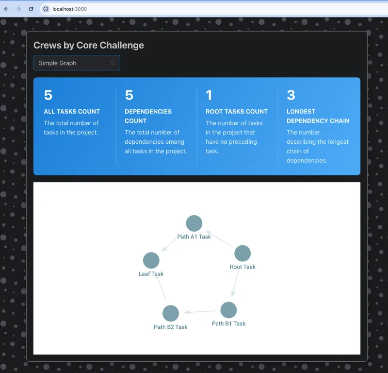

## Challenge Submission Notes

Here are some notes for the requirements:

- General
  - Using TypeScript
    - I changed the project from JavaScript to TypeScript
  - Hooks
    - I created a couple hooks (useActiveProject() and query helper hooks) to modularize the project
  - Testing
    - I did not get around to writing any unit tests. If I had more time, I would write tests for the graph compute functions.
  - Error States
    - I did not handle any error states. It helps that the data is static, but anything other than the happy path isn't implemented.
  - Asynchronous Loading / Request Waterfalls
    - There are some loading spinners and 'Loading...' message fallbacks during fetching of projects, tasks, and dependencies.
  - Internet Copy/Pasting
    - The ProjectSelector component is largely from mantine.dev's example ComboBox.
    - StatsGroup.tsx and StatsGroup.module.css were copied from mantine.dev examples. I modified StatsGroup.tsx a bit to add typing.
    - The app shell is created with create-react-app's TypeScript template.
    - The Zustand store creation is modified from some Zustand examples.
- Fetch projects, tasks, and dependencies from api
  - Calculating Statistics
    - I added a mocked API route to calculate statistics. The idea is that something computationally intensive like statistics might be calculated and cached server-side and exposed to the frontend.
  - Using a Fetching Library
    - I used TanStack's useQuery() hook library because it logically separates the network store from the client UI store, and has a lot of useful built-ins (e.g. "is the data currently fetching?" and "is there an error state?") and handles caching and retrying and more.
- Store data in a state management library, e.g. Redux
  - Using Zustand over Redux
    - I decided to go with a lightweight library called Zustand, since we don't need the advantages of Redux or its boilerplate
  - Pairing State Updating w/ an Immutable Helper
    - To avoid updating state with spread ... syntax, I used an immutable state helper middleware similar to immer called mutative. It allows you to modify state like a normal object, but behind the scenes it tracks what changes. For updating deeply nested arrays or objects, this pattern is much easier to use.
- Add your own component styles, whether css files, inline, scss, etc.
  - Using Mantine UI Component Library
    - I brought in Mantine UI for its <ComboBox> component, <StatGroup> component, and a couple minor <Flex> or <Text>. While I could implement these myself, I feel like I was still able to demonstrate the ability to write CSS throughout the rest of the app without needing to implement components from scratch.
  - Using CSS Modules
    - I used CSS modules for most styling. A couple places use inline styles for one-time/throwaway styling.
  - CSS Variables
    - These are from Mantine styles copy/pasting. In a real work environment, I would try to use CSS variables where possible and be more consistent with their usage.
  - Layout
    - The app layout is styled using a combination of grid and flexbox.
  - Responsiveness
    - The StatsGroup copied from Mantine's examples (with slight modifications) is responsive, so I don't get any points here. But other than media queries, container queries are a pretty neat feature that work like per-component media queries based not on the browser's width but on the containing element's width.
- Compute graph statistics
  - task count
    - I calculated this as the length of the tasks array for that specific project.
  - dependency count
    - I calculated this as the length of the dependencies array for that specific project.
  - root count (i.e. a task that isn't a successor)
    - I calculated this as the number of tasks that aren't included in any dependencies "successor_id" entries.
  - longest path between a root and a leaf
    - I calculated this by going from each root node to leaf nodes and recording the longest path.
    - There's a comment in compute.ts, but the key insight I found out later was pruning edges from less-than-best-known paths. That significantly reduced the number of iterations for future traversals.
- Integrate a 3rd party directed-graph visualization library
  - I found a library called 'reagraph' to do the visualization. It can be a little slower on the Challenge Graph. It takes up to 10 seconds for it to even show the white rendering box.
